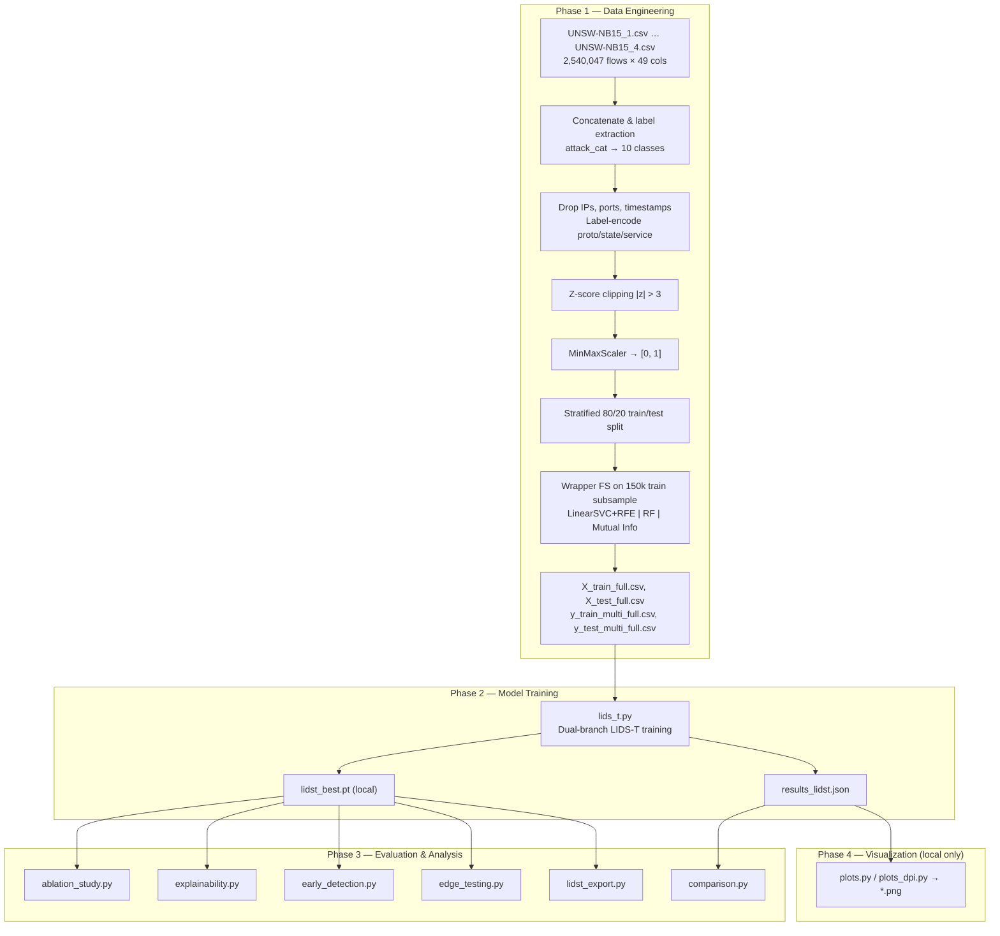
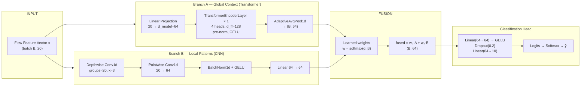

# LIDS-T: Lightweight IoT Intrusion Detection Transformer

**LIDS-T** is a parameter-efficient, dual-branch deep learning architecture for **multiclass network intrusion detection (NIDS)** on tabular flow-level features. The system targets **IoT edge deployment** by combining a lightweight Transformer encoder with a depthwise-separable 1D-CNN, trained on the full **UNSW-NB15** benchmark (~2.54 million flows, 10 attack categories, 20 selected features).

This repository extends the binary Transformer baseline published in *Scientific Reports* (2025, [DOI 10.1038/s41598-025-11348-5](https://doi.org/10.1038/s41598-025-11348-5)) to a harder **10-class multiclass** task while reducing trainable parameters from ~270k to **45,320** (−83.2%).

---

## Authors

| Author | Affiliation |
|--------|-------------|
| **Katrina Bodani** | Information Security — University of L'Aquila |
| **Tayyab Rehman** | Information Security — University of L'Aquila |

---

## Repository Contents

This repository intentionally tracks **source code** and **experiment result JSON files** only.

| Tracked in Git | Excluded from Git (generated locally) |
|----------------|---------------------------------------|
| Python scripts (`.py`) | Plot images (`.png`) |
| Result metrics (`.json`) | PDF reports (`.pdf`) |
| Config manifests (`selected_features.json`, etc.) | Model weights (`.pt`, `.onnx`) |
| `requirements.txt`, `README.md` | Raw/processed CSV datasets (too large) |

Processed CSV files (`X_train_full.csv`, `X_test_full.csv`, label files) are **produced by `preprocess_full.py`** and remain local. Plots are regenerated with `plots.py` / `plots_dpi.py` after experiments complete.

---

## 1. Problem Formulation

Given a network flow record represented as a feature vector **x** ∈ ℝ²⁰, the model learns a mapping:

\[
f_\theta : \mathbb{R}^{20} \rightarrow \mathbb{R}^{10}, \quad \hat{y} = \arg\max_k \; f_\theta(\mathbf{x})_k
\]

where each class corresponds to an attack category or Normal traffic. The objective is to maximize detection accuracy and macro-F1 on minority attack classes while satisfying **edge constraints**: model size < 200 KB (float32), inference latency < 2 ms/sample on CPU, and peak RAM < 10 KB during single-sample inference.

**Class imbalance.** Normal traffic comprises ~87% of UNSW-NB15. Training uses **inverse-frequency class weights**:

\[
w_c = \frac{N}{K \cdot n_c}
\]

where \(N\) is total training samples, \(K = 10\) classes, and \(n_c\) is the count of class \(c\). These weights are applied in weighted cross-entropy loss.

---

## 2. End-to-End Methodology



### 2.1 Preprocessing Pipeline (`preprocess_full.py`)

| Step | Operation | Rationale |
|------|-----------|-----------|
| 1 | Load 4 raw CSV parts (no header, 49 columns) | Full UNSW-NB15 coverage |
| 2 | Map `attack_cat` → 10 classes; empty → Normal; `Backdoors` → Backdoor | Multiclass label space |
| 3 | Drop `srcip`, `dstip`, `Stime`, `Ltime`, `sport`, `dsport` | Remove identifiers & temporal leakage |
| 4 | `LabelEncoder` on `proto`, `state`, `service` | Categorical → integer |
| 5 | Median imputation for NaN; coerce to float32 | Handle missing protocol fields |
| 6 | Z-score clipping at ±3σ per feature | Outlier robustness without row deletion |
| 7 | `MinMaxScaler` fit on full data, then split | Bounded [0,1] input range |
| 8 | Stratified 80/20 split **before** feature selection | Prevent selection leakage |
| 9 | Wrapper feature selection on 150k stratified train subsample | Reproducible top-20 features |
| 10 | Export 20-feature matrices + multiclass labels | Training-ready CSV outputs |

### 2.2 Feature Selection Methodology

Three independent selectors vote on a 150,000-row stratified subsample drawn **only from the training set**:

1. **LinearSVC + RFE** (recursive feature elimination, step=5, C=0.1)
2. **Random Forest** (100 trees, max_depth=10) — top-20 by Gini importance
3. **SelectKBest** with **mutual information** (NB-equivalent filter method)

Each algorithm contributes one vote per selected feature. The **top 20 features by vote frequency** form the final input space (see `selected_features.json`). This ensemble wrapper approach improves robustness over any single selector used in the base paper (SVM + RF + Naive Bayes).

### 2.3 Training Protocol (`lids_t.py`)

| Setting | Value |
|---------|-------|
| Optimizer | AdamW (lr = 1×10⁻³, weight decay = 1×10⁻⁴) |
| Loss | Weighted CrossEntropyLoss |
| Scheduler | ReduceLROnPlateau (patience=3, factor=0.5, min_lr=1×10⁻⁶) |
| Batch size | 2048 |
| Max epochs | 50 |
| Early stopping | patience = 7 on validation loss |
| Validation split | 10% stratified from training set |
| Gradient clipping | max norm = 1.0 |
| Random seed | 42 |
| Hardware | CUDA GPU if available, else CPU |

**Evaluation metrics:** accuracy, weighted precision/recall/F1, macro-F1, per-class F1, confusion matrix. Inference latency benchmarked over 1,000 single-sample forward passes after 10 warmup iterations.

---

## 3. Architecture

### 3.1 System Architecture Diagram



### 3.2 Layer-Level Specification

```
Input x ∈ R^(B×20)
│
├─ Branch A (Transformer)
│    Linear(20, 64)                    →  (B, 64)
│    unsqueeze(1)                       →  (B, 1, 64)    # sequence length = 1
│    TransformerEncoderLayer × 1:
│      MultiHeadAttention(4 heads, d=64)
│      FFN(64 → 128 → 64), GELU, pre-norm
│    AdaptiveAvgPool1d(1)               →  (B, 64)
│
├─ Branch B (Depthwise Separable CNN)
│    unsqueeze(-1)                      →  (B, 20, 1)
│    Conv1d(20→20, k=3, groups=20)     # depthwise
│    Conv1d(20→64, k=1)                 # pointwise
│    BatchNorm1d(64) + GELU
│    squeeze(-1)                        →  (B, 64)
│    Linear(64, 64)                     →  (B, 64)
│
├─ Fusion
│    w = softmax([α, β])                # learnable scalars
│    h = w₀·A + w₁·B                   →  (B, 64)
│
└─ Head
     Dropout(0.2)
     Linear(64, 64) → GELU → Dropout(0.2)
     Linear(64, 10)                     →  (B, 10) logits
```

### 3.3 Design Rationale

| Design decision | Technical justification |
|-----------------|------------------------|
| **d_model = 64** (vs 128 in base paper) | Halves attention parameter count; sufficient for 20 tabular features |
| **Single Transformer layer** | Tabular flows lack sequential structure; depth adds params without proportional gain |
| **Depthwise separable conv** | ~8–10× fewer parameters vs standard Conv1d; captures per-feature local patterns |
| **Learned fusion weights** | Model adaptively balances global (Transformer) vs local (CNN) representations |
| **Pre-norm Transformer** (`norm_first=True`) | Stabilizes gradient flow in shallow encoder |
| **GELU activation** | Smoother gradients than ReLU on bounded tabular inputs |
| **Class-weighted loss** | Critical for macro-F1 on minority classes (Analysis, Backdoor, Worms) |

### 3.4 Parameter Budget

| Module | Parameters |
|--------|------------|
| Transformer branch (`input_proj` + encoder) | ~33,600 |
| CNN branch (`cnn_branch` + `cnn_proj`) | ~10,500 |
| Fusion + classification head | ~1,220 |
| **Total trainable** | **45,320** |
| Base paper reference | 270,249 |
| **Reduction** | **83.2%** |
| Estimated float32 size | 177 KB |

---

## 4. Experimental Methodology

### 4.1 Ablation Study (`ablation_study.py`)

Four configurations trained with **identical hyperparameters, data, and seed** to isolate component contributions:

| Config | Branch A | Branch B | Class weights | Purpose |
|--------|----------|----------|---------------|---------|
| Transformer Only | ✓ | ✗ | ✓ | Measure global-context branch alone |
| CNN Only | ✗ | ✓ | ✓ | Measure local-pattern branch alone |
| No Class Weights | ✓ | ✓ | ✗ | Measure imbalance-handling impact |
| **Full LIDS-T** | ✓ | ✓ | ✓ | Complete proposed model |

### 4.2 Explainability (`explainability.py`)

**SHAP** (SHapley Additive exPlanations) applied to the trained LIDS-T checkpoint:

- Background dataset: stratified sample from training set
- Per-class feature attribution ranked by mean |SHAP value|
- Outputs saved to `results_shap.json`; visualizations generated locally

### 4.3 Early Detection (`early_detection.py`)

Simulates **partial-flow classification** for IoT gateways that must decide before all 20 features are available:

1. Order features by wrapper selection vote frequency (most important first)
2. Zero-mask all features beyond top-K
3. Run inference with frozen pre-trained weights (no retraining)
4. Record accuracy and macro-F1 vs K ∈ {1, 2, …, 20}

### 4.4 Edge Deployment Profiling (`edge_testing.py`)

| Experiment | Method | Metric |
|------------|--------|--------|
| RAM footprint | `tracemalloc` during single-sample inference | Peak KB |
| CPU latency | 1,000 runs, batch sizes {1, 8, 32, 128}, no GPU | mean/p95/p99 ms |
| Compute cost | `thop` FLOPs profiler | Total FLOPs |
| Deployment matrix | Score vs 4 hardware tiers (Pi, Jetson, gateway, server) | Pass/fail per constraint |

### 4.5 Model Export (`lidst_export.py`)

1. Export PyTorch → **ONNX** (opset 11, dynamic batch axis)
2. Validate prediction parity (max logit diff < 1×10⁻⁴)
3. Apply **INT8 dynamic quantization** on Linear layers
4. Benchmark ONNX Runtime latency (simulates ARM edge CPU)

### 4.6 Binary Baseline (`binary/`)

Reproduces the reference paper's **2-class** Transformer on a 257k-row subset:

- Architecture: Linear(20→128) → 2× TransformerEncoderLayer → GAP → Dense(20) → Sigmoid
- ~270k parameters; BCELoss with positive class weighting
- Results in `results_binary.json`; compared against LIDS-T via `comparison.py`

---

## 5. Dataset

**UNSW-NB15** — 49 network flow features per record, 10 attack categories + Normal.

| Class | Description |
|-------|-------------|
| Normal | Benign traffic |
| Analysis | Port scan, spam, HTML attack probing |
| Backdoor | Backdoor shell access |
| DoS | Denial of service |
| Exploits | Remote exploit execution |
| Fuzzers | Fuzzing attack attempts |
| Generic | Generic attack patterns |
| Reconnaissance | Network reconnaissance |
| Shellcode | Shellcode injection |
| Worms | Self-propagating malware |

**Selected 20 features** (`selected_features.json`):

`state`, `dttl`, `sttl`, `ct_dst_src_ltm`, `ct_dst_sport_ltm`, `ct_src_dport_ltm`, `ct_state_ttl`, `smeansz`, `dmeansz`, `synack`, `Dintpkt`, `ct_srv_dst`, `Sload`, `sbytes`, `dbytes`, `ct_srv_src`, `service`, `Dload`, `Sintpkt`, `Dpkts`

Download raw files from the [UNSW-NB15 project page](https://research.unsw.edu.au/projects/unsw-nb15-dataset).

---

## 6. Results

### 6.1 Primary Metrics (`results_lidst.json`)

| Metric | LIDS-T (10-class) | Base Paper (binary) |
|--------|-------------------|---------------------|
| Accuracy | **0.9671** | 0.9300 |
| Weighted Precision | **0.9824** | 0.9100 |
| Weighted Recall | **0.9671** | 0.9200 |
| Weighted F1 | **0.9727** | 0.9200 |
| Macro F1 | **0.7870** | — |
| Parameters | **45,320** | 270,249 |
| Model size | **177 KB** | ~1,082 KB |
| GPU latency | 1.21 ms/sample | — |
| CPU latency | 0.75 ms/sample | — |
| Dataset scale | 2,540,047 flows | 257,673 flows |

### 6.2 Ablation Results (`results_ablation.json`)

| Configuration | Accuracy | Weighted F1 | Macro F1 | Params |
|---------------|----------|-------------|----------|--------|
| Transformer Only | 0.9074 | 0.8200 | 0.5245 | 39,626 |
| CNN Only | 0.9692 | 0.9737 | 0.5388 | 10,502 |
| No Class Weights | 0.9450 | 0.6570 | 0.5070 | 45,320 |
| **Full LIDS-T** | **0.9671** | **0.9727** | **0.7870** | **45,320** |

**Key finding:** Neither branch alone achieves competitive macro-F1 on minority classes. Full LIDS-T with class weighting improves macro-F1 by **+50%** over Transformer-only and **+46%** over CNN-only, demonstrating that dual-branch fusion and imbalance-aware loss are both necessary.

### 6.3 Edge Deployment (`results_edge_profile.json`)

| Metric | Value |
|--------|-------|
| Peak inference RAM | 3.84 KB |
| CPU latency (batch=1, mean) | 0.75 ms |
| CPU latency (batch=1, p95) | 1.33 ms |
| ONNX float32 size | 152.4 KB |
| INT8 quantized size | 88.5 KB |
| ONNX prediction match | 500/500 samples |

---

## 7. Repository Structure

```
LIDS-T/
├── lids_t.py                 # Core model definition, training, evaluation
├── preprocess_full.py        # Full-dataset multiclass preprocessing pipeline
├── feature_selection.py      # RF + XGBoost wrapper ranking (binary subset)
├── ablation_study.py         # 4-configuration ablation experiments
├── explainability.py         # SHAP per-class feature attribution
├── early_detection.py        # Progressive feature-masking experiment
├── edge_testing.py           # RAM, latency, FLOPs, deployment matrix
├── lidst_export.py           # ONNX export + INT8 quantization
├── comparison.py             # Binary vs multiclass comparison (JSON-driven)
├── plots.py                  # Generate paper figures locally
├── plots_dpi.py              # High-DPI figure variants
├── binary/
│   ├── preprocessing.py      # Binary-task data pipeline
│   └── binary_baseline.py      # Reference paper Transformer reproduction
├── attack_class_names.json   # 10-class label names
├── class_mapping.json        # Index → class name map
├── feature_cols.json           # Full feature column list
├── selected_features.json    # Final 20 selected features
├── results_lidst.json        # Primary training results
├── results_ablation.json     # Ablation study metrics
├── results_binary.json       # Binary baseline metrics
├── results_comparison.json   # Head-to-head comparison
├── results_early_detection.json
├── results_edge_profile.json
├── results_export.json       # ONNX/quantization benchmarks
├── results_shap.json         # SHAP attribution summaries
└── requirements.txt
```

---

## 8. Installation & Reproduction

```bash
git clone https://github.com/katrinabodani/LIDS-T.git
cd LIDS-T
pip install -r requirements.txt
```

Place `UNSW-NB15_1.csv` … `UNSW-NB15_4.csv` in the project root, then:

```bash
# Phase 1 — Preprocessing (generates local CSV files)
python preprocess_full.py

# Phase 2 — Train LIDS-T
python lids_t.py

# Phase 3 — Experiments (optional)
python ablation_study.py
python explainability.py
python early_detection.py
python edge_testing.py
python lidst_export.py

# Phase 4 — Analysis & local plots
python comparison.py
python plots.py
```

---

## 9. Citation

```bibtex
@article{lids_t_2025,
  author  = {Bodani, Katrina and Rehman, Tayyab},
  title   = {LIDS-T: Lightweight IoT Intrusion Detection Transformer},
  year    = {2025},
  note    = {Multiclass extension of transformer-based NIDS}
}

@article{base_paper_2025,
  title   = {Network intrusion detection using transformer-based deep learning},
  journal = {Scientific Reports},
  year    = {2025},
  doi     = {10.1038/s41598-025-11348-5}
}
```

---

## 10. License

Academic research project. UNSW-NB15 dataset usage is subject to the dataset provider's terms.
